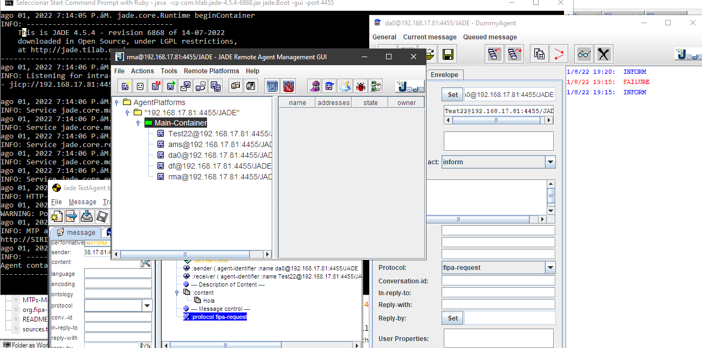

# p20-jade-fipa: a proposal to upgrade JADE-v4.5.4-r6868

Full description of this proposal is available at:
-  <https://dpsframework.org/proposals/P20-JADE-FIPA_en.html>


## 1. Introduction

1. This is the exact version of JADE-4.5.4-6868, copied from the JADE Trunk, which has been prepared to be compiled with Maven.

1. This proposal is a simple organization of the JADE code, which uses the sources of the CORBA and Apache Commons Codec libraries. This version of JADE (jade-4.5.4-6868.jar) is a perfect starting point to start a deeper analysis of the JADE Platform and its evolution in the next 5 years.

1. Of course, all this is thanks to the efforts of the TILAB Team. And also, it is thanks to the proposed evolution in Java for the use of the Java Platform Module System.


### 1.1. To obtain the current version of JADE

- **Use Maven for full packaging using:**

```shell
 git clone https://github.com/dpsframework/p20-jade-fipa.git
 cd  p20-jade-fipa

 mvn package
```
- That's all!
- This generates `jade-4.5.4-6868.jar` ready to use.

### 1.2 A starting point for new proposals:

#### 1.2.1. Take a look at the file: `module-info.java`

- It is located in the /src/main/java/jade/ directory.

```java
/**
 * JADE Revision 6868 version 4.5.4. by, Enrico Scagliotti and Giovanni Caire.
 * Source:   https://jade.tilab.com/svn/jade/trunk
 * Revision: 6868
 * Author: caire
 * Date: jueves, 14 de julio de 2022 11:06:20
 * Message: Properly logged the stack-trace when an unexpected error occurs creating an agent.
 * Modified : /trunk/src/jade/core/management/AgentManagementService.java
 * ---
 * Revision: 6867
 * Author: scagliotti
 * Date: viernes, 29 de abril de 2022 12:07:55
 * Message: Upgraded version to 4.5.4
 * Modified : /trunk/build.properties
 * ---
 * This proposal: P20-JADE-FIPA    https://dpsframework.org/proposals/P20-JADE-FIPA_en.html
 * Source at:     GitHub           https://github.com/dpsframework/p20-jade-fipa
 * Commons-Codec: https://archive.apache.org/dist/commons/codec/binaries/commons-codec-1.3.tar.gz
 *            
 */
module com.tilab.jade {
	exports jade;
    
	requires org.fipa;
    
	requires java.logging;
	requires java.desktop;
	requires java.rmi;
	requires java.management;
	requires java.sql;
	requires java.net.http;
}

```


#### 1.2.2. To make a manual compiling/packaging from the console

- **On Windows console**:

```shell
 robocopy src\main\java\        target\classes\    /XF *.java /E /NFL
 dir      src\main\java\*.java   /s/b    >  sources-jade.list
```


- **On GNU-Linux or OS-X**:

```shell
 rsync   -av --exclude=*java  src/main/java/   target/classes/
 find    src/main/java/.  -iname  *java  -type f   > sources-jade.list
```


- **Compiling and packaging by-hand with**:

```shell
 javac   -d   target/classes    @sources-jade.list
 jar     --create --file  jade-4.5.4-6868.jar  -C target/classes  .
 jar     --update --file jade-4.5.4-6868.jar --manifest=src/main/resources/META-INF/MANIFEST.MF
```

- **And check the result again with**:

```shell 
 java -jar jade-4.5.4-6868.jar -gui
```

- **If you need to access the JADE platform from port 7778**, you need to use **--add-opens** with Java JDK-9 or higher. To do this proceed with:

```shell

 java --add-opens java.xml/com.sun.org.apache.xerces.internal.jaxp=jade -jar jade-4.5.4-6868.jar -gui
```

- **And test it with**:

```shell
 http://localhost:7778/acc/
 
```
- To obtain `WARNING: Malformed POST` on JADE Console output.


**Fig. 1**: From the JADE RMA Agent Actions menu, an agent of type `jade.tools.testagent.TestAgent` named **Test22** has been created. It is visible in the lower left corner. With the "Start-DummigAgent" button, the agent named "da0@local-ip-address/JADE" has been created. And an INFORM type message with "fipa-request" Interaction Protocol has been sent between these entities. The message is received and displayed by the Test22 agent.




